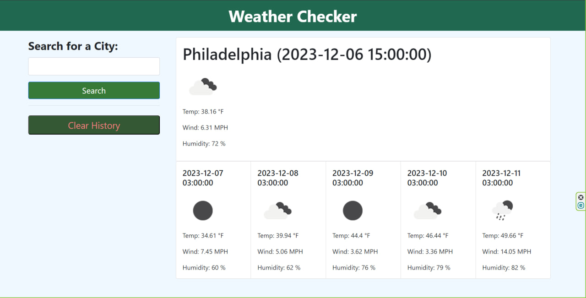
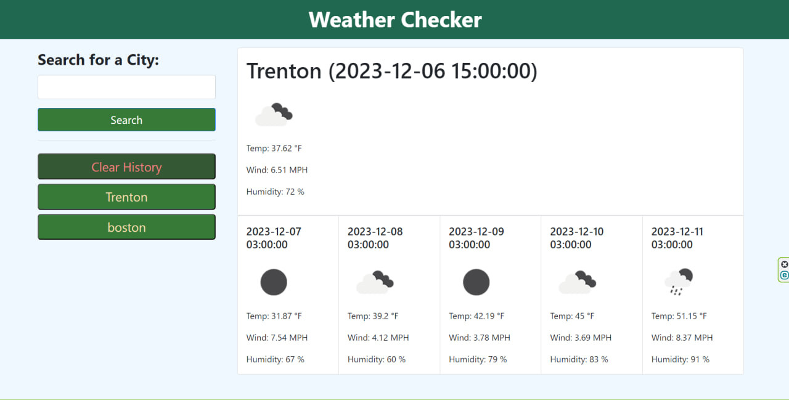

# Weather-Checker
Web app for weather checking in different cities. 

## Description

I wanted to create a weather web app that can track city that I can put in the search form. I added a Third-party API https://openweathermap.org/forecast5, who has open source with weather for 5 days ahead. I added functionality for representing information about the city user will search for today and for each 5 days ahead. I made buttons to store history of the city user will search, and I made a clear button to clear history for better user expirience.
## Table of Contets

- [Screenshots](#screenshots)
- [Links](#links)

## Screenshots

In this section I provided screenshots of the Deployed Website Application.

## Links

In this section I added links to the deployed application and to the GitHub repositories with the original codebase.

Deployed application
    https://mykhailozakh.github.io/Weather-Checker/

Project Repository
    https://github.com/MykhailoZakh/Weather-Checker